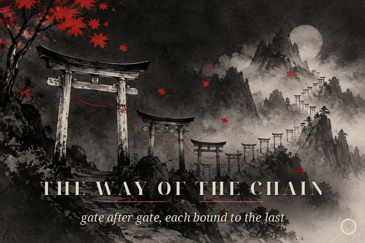

<p align="center"><a href="#top"></a></p>

<p align="center">
  <a href="https://linkedin.com/in/siddhant">linkedin</a> &nbsp;·&nbsp;
  <a href="https://siddhant.tech">siddhant.tech</a> &nbsp;·&nbsp;
  <a href="mailto:sk6917@srmist.edu.in">email</a> &nbsp;·&nbsp;
  <a href="https://drive.google.com/file/d/1w8hEMrvuLSYpJ_kBHOfAO2JHLGv55zAp/view?usp=drive_link">cv</a>
</p>

## ~/about

```text
cs (iot) @ srmist, class of '28
evm, backend & genai - defi native, eth ftw
kinda obsessive about everything i build
```

<a name="top"></a>


<!-- contribution-quest:begin -->

## ~/play

<details name="xp" open>
<summary><b>༄ the crossroads</b> - a contribution quest</summary>
<a id="xp-map"></a>
<p align="center"></p>
<p align="center">
<sub>four paths, four kinds of work - every merged pull request lives here.<br>
<b>100 merged prs</b> and counting; the quest renews itself with each new merge.</sub><br><br>
<a href="#user-content-xp-mind"><b>心 &nbsp;the way of the mind</b></a> &nbsp;·&nbsp;
<a href="#user-content-xp-blade"><b>刃 &nbsp;the way of the blade</b></a> &nbsp;·&nbsp;
<a href="#user-content-xp-chain"><b>鎖 &nbsp;the way of the chain</b></a> &nbsp;·&nbsp;
<a href="#user-content-xp-scroll"><b>巻 &nbsp;the way of the scroll</b></a><br>
<sub><a href="assets/ronin-theme.mp3">♪ play the theme</a> - original instrumental, no autoplay</sub>
</p>
</details>

<details name="xp">
<summary><b>心 the way of the mind</b> - ai that shows its work</summary>
<a id="xp-mind"></a>
<p align="center"></p>
<p align="center">
<a href="#user-content-xp-shrine-mind"><b>press on to the shrine →</b></a><br>
<sub><a href="assets/ronin-theme.mp3">♪ play the theme</a> &nbsp;·&nbsp; <a href="#user-content-xp-map">↩ return to the crossroads</a></sub>
</p>
</details>

<details name="xp">
<summary><b>刃 the way of the blade</b> - cutting vulnerabilities out</summary>
<a id="xp-blade"></a>
<p align="center"></p>
<p align="center">
<a href="#user-content-xp-shrine-blade"><b>press on to the shrine →</b></a><br>
<sub><a href="assets/ronin-theme.mp3">♪ play the theme</a> &nbsp;·&nbsp; <a href="#user-content-xp-map">↩ return to the crossroads</a></sub>
</p>
</details>

<details name="xp">
<summary><b>鎖 the way of the chain</b> - a blockchain, built from scratch</summary>
<a id="xp-chain"></a>
<p align="center"></p>
<p align="center">
<a href="#user-content-xp-shrine-chain"><b>press on to the shrine →</b></a><br>
<sub><a href="assets/ronin-theme.mp3">♪ play the theme</a> &nbsp;·&nbsp; <a href="#user-content-xp-map">↩ return to the crossroads</a></sub>
</p>
</details>

<details name="xp">
<summary><b>巻 the way of the scroll</b> - the formstr suite, shipped</summary>
<a id="xp-scroll"></a>
<p align="center"></p>
<p align="center">
<a href="#user-content-xp-shrine-scroll"><b>press on to the shrine →</b></a><br>
<sub><a href="assets/ronin-theme.mp3">♪ play the theme</a> &nbsp;·&nbsp; <a href="#user-content-xp-map">↩ return to the crossroads</a></sub>
</p>
</details>

<details name="xp">
<summary><b>⛩ shrine of the mind</b> - skillcheck &amp; own products</summary>
<a id="xp-shrine-mind"></a>
<p align="center"><i>ai that shows its work. every merged pr on that road:</i></p>
<p align="center"><b>skillcheck, paperly &amp; research</b> · <b>4 merged prs</b></p>
<p align="center">
<sub><b>SIDDHANTCOOKIE/SkillCheck</b> · 2 merged</sub><br>
<sub><a href="https://github.com/SIDDHANTCOOKIE/SkillCheck/pull/2"><b>#2</b> Add structural rules, multilingual prose detection, shell de-obfuscation</a> · merged aug 14, 2026</sub><br>
<sub><a href="https://github.com/SIDDHANTCOOKIE/SkillCheck/pull/1"><b>#1</b> Ao/skills 2/root</a> · merged aug 13, 2026</sub><br>
<br>
<sub><b>DemocratiseResearch/SARAL</b> · 1 merged</sub><br>
<sub><a href="https://github.com/DemocratiseResearch/SARAL/pull/29"><b>#29</b> polish readme</a> · merged jul 8, 2026</sub><br>
<br>
<sub><b>SIDDHANTCOOKIE/DocuFlow</b> · 1 merged</sub><br>
<sub><a href="https://github.com/SIDDHANTCOOKIE/DocuFlow/pull/1"><b>#1</b> Restore Vite entry script to fix blank Vercel deployment</a> · merged feb 13, 2026</sub><br>
<br>
<sub><a href="#user-content-xp-map">↩ walk another path</a></sub>
</p>
</details>

<details name="xp">
<summary><b>⛩ shrine of the blade</b> - smart-contract security</summary>
<a id="xp-shrine-blade"></a>
<p align="center"><i>vulnerabilities cut out of live codebases, wherever they hid:</i></p>
<p align="center"><b>security work, merged upstream</b> · <b>5 merged prs</b></p>
<p align="center">
<sub><b>StabilityNexus/HammerAuctionHouse-Solidity</b> · 2 merged</sub><br>
<sub><a href="https://github.com/StabilityNexus/HammerAuctionHouse-Solidity/pull/68"><b>#68</b> fix: conditionally extend deadline in anti-sniping window</a> · merged mar 30, 2026</sub><br>
<sub><a href="https://github.com/StabilityNexus/HammerAuctionHouse-Solidity/pull/38"><b>#38</b> fix: Reentrancy in VickreyAuction</a> · merged feb 6, 2026</sub><br>
<br>
<sub><b>healthyinc/bio-block</b> · 2 merged</sub><br>
<sub><a href="https://github.com/healthyinc/bio-block/pull/147"><b>#147</b> fix: enforce cryptographic signature validation</a> · merged mar 6, 2026</sub><br>
<sub><a href="https://github.com/healthyinc/bio-block/pull/106"><b>#106</b> fix: use call instead of transfer in withdrawEarnings</a> · merged feb 8, 2026</sub><br>
<br>
<sub><b>StabilityNexus/MiniChain</b> · 1 merged</sub><br>
<sub><a href="https://github.com/StabilityNexus/MiniChain/pull/120"><b>#120</b> security-fix: resolve critical network, state, and sandbox vulnerabilit…</a> · merged jul 15, 2026</sub><br>
<br>
<sub><a href="#user-content-xp-map">↩ walk another path</a></sub>
</p>
</details>

<details name="xp">
<summary><b>⛩ shrine of the chain</b> - minichain &amp; web3</summary>
<a id="xp-shrine-chain"></a>
<p align="center"><i>chains, contracts and the tooling around them. every merged pr:</i></p>
<p align="center"><b>web3 &amp; protocol engineering</b> · <b>69 merged prs</b></p>
<p align="center">
<sub><b>StabilityNexus/MiniChain</b> · 43 merged</sub><br>
<sub><a href="https://github.com/StabilityNexus/MiniChain/pull/136"><b>#136</b> Docs/contributing maintainers agents</a> · merged aug 13, 2026</sub><br>
<sub><a href="https://github.com/StabilityNexus/MiniChain/pull/138"><b>#138</b> feat: add Docker image build/push to the release workflow</a> · merged aug 12, 2026</sub><br>
<sub><a href="https://github.com/StabilityNexus/MiniChain/pull/137"><b>#137</b> Feat/release automation</a> · merged aug 11, 2026</sub><br>
<sub><a href="https://github.com/StabilityNexus/MiniChain/pull/134"><b>#134</b> feat: Implement StateJournal and in-memory snapshots for state rollback</a> · merged aug 10, 2026</sub><br>
<sub><a href="https://github.com/StabilityNexus/MiniChain/pull/133"><b>#133</b> refactor: change PoW difficulty to numeric target hash threshold</a> · merged aug 10, 2026</sub><br>
<sub><a href="https://github.com/StabilityNexus/MiniChain/pull/132"><b>#132</b> Feat/state gas metering</a> · merged jul 28, 2026</sub><br>
<sub><a href="https://github.com/StabilityNexus/MiniChain/pull/130"><b>#130</b> add example contract</a> · merged jul 22, 2026</sub><br>
<sub><a href="https://github.com/StabilityNexus/MiniChain/pull/128"><b>#128</b> feat: Implement synchronous cross-contract calls and robust state</a> · merged jul 22, 2026</sub><br>
<sub><a href="https://github.com/StabilityNexus/MiniChain/pull/119"><b>#119</b> feat: improved tokenomics</a> · merged jul 22, 2026</sub><br>
<sub><a href="https://github.com/StabilityNexus/MiniChain/pull/124"><b>#124</b> feat: Implement dynamic state and code gas metering</a> · merged jul 15, 2026</sub><br>
<sub><a href="https://github.com/StabilityNexus/MiniChain/pull/123"><b>#123</b> refactor: Extract hardcoded constants into node and network config</a> · merged jul 15, 2026</sub><br>
<sub><a href="https://github.com/StabilityNexus/MiniChain/pull/127"><b>#127</b> fix the badge</a> · merged jul 9, 2026</sub><br>
<sub><a href="https://github.com/StabilityNexus/MiniChain/pull/126"><b>#126</b> update badge size</a> · merged jul 9, 2026</sub><br>
<sub><a href="https://github.com/StabilityNexus/MiniChain/pull/125"><b>#125</b> update badge</a> · merged jul 9, 2026</sub><br>
<sub><a href="https://github.com/StabilityNexus/MiniChain/pull/118"><b>#118</b> chore: ci setup for pytests</a> · merged jul 9, 2026</sub><br>
<sub><a href="https://github.com/StabilityNexus/MiniChain/pull/117"><b>#117</b> feat: Add Ethereum-style timestamp validation and PoW hash check</a> · merged jul 9, 2026</sub><br>
<sub><a href="https://github.com/StabilityNexus/MiniChain/pull/116"><b>#116</b> remove code smells, duplicate codex and refactor</a> · merged jul 6, 2026</sub><br>
<sub><a href="https://github.com/StabilityNexus/MiniChain/pull/114"><b>#114</b> feat: implement basic keystore persistence and CLI wallet commands</a> · merged jul 6, 2026</sub><br>
<sub><a href="https://github.com/StabilityNexus/MiniChain/pull/113"><b>#113</b> Feat/peer blacklisting</a> · merged jul 3, 2026</sub><br>
<sub><a href="https://github.com/StabilityNexus/MiniChain/pull/111"><b>#111</b> Feat/libp2p</a> · merged jul 3, 2026</sub><br>
<sub><a href="https://github.com/StabilityNexus/MiniChain/pull/110"><b>#110</b> Feat/difficulty</a> · merged jul 3, 2026</sub><br>
<sub><a href="https://github.com/StabilityNexus/MiniChain/pull/106"><b>#106</b> Feat/peer blacklisting</a> · merged jul 2, 2026</sub><br>
<sub><a href="https://github.com/StabilityNexus/MiniChain/pull/104"><b>#104</b> feat: implemented (EMA) difficulty adjustment</a> · merged jul 2, 2026</sub><br>
<sub><a href="https://github.com/StabilityNexus/MiniChain/pull/105"><b>#105</b> minichain ascii art</a> · merged jun 29, 2026</sub><br>
<sub><a href="https://github.com/StabilityNexus/MiniChain/pull/102"><b>#102</b> Feat/libp2p</a> · merged jun 26, 2026</sub><br>
<sub><a href="https://github.com/StabilityNexus/MiniChain/pull/101"><b>#101</b> Feat/contract transfers</a> · merged jun 26, 2026</sub><br>
<sub><a href="https://github.com/StabilityNexus/MiniChain/pull/100"><b>#100</b> Feat/fork choice</a> · merged jun 25, 2026</sub><br>
<sub><a href="https://github.com/StabilityNexus/MiniChain/pull/98"><b>#98</b> feat: implement JSON-RPC 2.0 server using aiohttp</a> · merged jun 25, 2026</sub><br>
<sub><a href="https://github.com/StabilityNexus/MiniChain/pull/99"><b>#99</b> Readme update</a> · merged jun 22, 2026</sub><br>
<sub><a href="https://github.com/StabilityNexus/MiniChain/pull/92"><b>#92</b> Feat/smart contracts</a> · merged jun 12, 2026</sub><br>
<sub><a href="https://github.com/StabilityNexus/MiniChain/pull/91"><b>#91</b> Feat/fee handling</a> · merged jun 12, 2026</sub><br>
<sub><a href="https://github.com/StabilityNexus/MiniChain/pull/89"><b>#89</b> Feat/ transaction receipts</a> · merged jun 12, 2026</sub><br>
<sub><a href="https://github.com/StabilityNexus/MiniChain/pull/88"><b>#88</b> feat: implement Merkle Patricia Trie for state verification</a> · merged jun 3, 2026</sub><br>
<sub><a href="https://github.com/StabilityNexus/MiniChain/pull/87"><b>#87</b> feat: implement external genesis configuration support</a> · merged may 29, 2026</sub><br>
<sub><a href="https://github.com/StabilityNexus/MiniChain/pull/78"><b>#78</b> Update blogs</a> · merged may 17, 2026</sub><br>
<sub><a href="https://github.com/StabilityNexus/MiniChain/pull/86"><b>#86</b> add logo</a> · merged may 15, 2026</sub><br>
<sub><a href="https://github.com/StabilityNexus/MiniChain/pull/70"><b>#70</b> minimization in mempool</a> · merged mar 26, 2026</sub><br>
<sub><a href="https://github.com/StabilityNexus/MiniChain/pull/62"><b>#62</b> Refactor for conceptual minimality in validation and deserialization fl…</a> · merged mar 21, 2026</sub><br>
<sub><a href="https://github.com/StabilityNexus/MiniChain/pull/54"><b>#54</b> fix: address CodeRabbit comments for pr #46</a> · merged mar 20, 2026</sub><br>
<sub><a href="https://github.com/StabilityNexus/MiniChain/pull/61"><b>#61</b> Fix: persistence.py function calls in main</a> · merged mar 17, 2026</sub><br>
<sub><a href="https://github.com/StabilityNexus/MiniChain/pull/60"><b>#60</b> refactor: simplify mempool to sorted queue and fix tx removal semantics</a> · merged mar 15, 2026</sub><br>
<sub><a href="https://github.com/StabilityNexus/MiniChain/pull/46"><b>#46</b> Feature/testnet demo</a> · merged mar 5, 2026</sub><br>
<sub><a href="https://github.com/StabilityNexus/MiniChain/pull/19"><b>#19</b> refactor: flatten directory structure to single minichain package</a> · merged feb 24, 2026</sub><br>
<br>
<sub><b>healthyinc/bio-block</b> · 7 merged</sub><br>
<sub><a href="https://github.com/healthyinc/bio-block/pull/188"><b>#188</b> feat: add on-chain purchase access tracking</a> · merged mar 6, 2026</sub><br>
<sub><a href="https://github.com/healthyinc/bio-block/pull/180"><b>#180</b> fix github auto-labeler</a> · merged mar 1, 2026</sub><br>
<sub><a href="https://github.com/healthyinc/bio-block/pull/173"><b>#173</b> Upgrade: nextjs 16 (phase 2)</a> · merged mar 1, 2026</sub><br>
<sub><a href="https://github.com/healthyinc/bio-block/pull/134"><b>#134</b> Upgrade: nextjs 16 (phase1)</a> · merged feb 25, 2026</sub><br>
<sub><a href="https://github.com/healthyinc/bio-block/pull/118"><b>#118</b> feature: added Hardhat test file for smart contract</a> · merged feb 11, 2026</sub><br>
<sub><a href="https://github.com/healthyinc/bio-block/pull/105"><b>#105</b> Implemented issue #42</a> · merged feb 11, 2026</sub><br>
<sub><a href="https://github.com/healthyinc/bio-block/pull/112"><b>#112</b> Add document metadata update and delete functionality</a> · merged feb 9, 2026</sub><br>
<br>
<sub><b>StabilityNexus/Chainvoice</b> · 5 merged</sub><br>
<sub><a href="https://github.com/StabilityNexus/Chainvoice/pull/156"><b>#156</b> add the new blogs link</a> · merged mar 27, 2026</sub><br>
<sub><a href="https://github.com/StabilityNexus/Chainvoice/pull/151"><b>#151</b> add merge conflict labelling workflow</a> · merged mar 25, 2026</sub><br>
<sub><a href="https://github.com/StabilityNexus/Chainvoice/pull/134"><b>#134</b> fixed startup failure in CI</a> · merged mar 22, 2026</sub><br>
<sub><a href="https://github.com/StabilityNexus/Chainvoice/pull/81"><b>#81</b> feat: Add two-step ownership transfer and admin events (#80)</a> · merged mar 22, 2026</sub><br>
<sub><a href="https://github.com/StabilityNexus/Chainvoice/pull/84"><b>#84</b> fix: prevent self-invoicing with frontend validation</a> · merged jan 31, 2026</sub><br>
<br>
<sub><b>StabilityNexus/Template-Repo-EVM-Contracts</b> · 3 merged</sub><br>
<sub><a href="https://github.com/StabilityNexus/Template-Repo-EVM-Contracts/pull/26"><b>#26</b> add the new blogs link</a> · merged may 28, 2026</sub><br>
<sub><a href="https://github.com/StabilityNexus/Template-Repo-EVM-Contracts/pull/25"><b>#25</b> add merge conflict labelling workflow</a> · merged mar 26, 2026</sub><br>
<sub><a href="https://github.com/StabilityNexus/Template-Repo-EVM-Contracts/pull/12"><b>#12</b> Chore/evm contract template</a> · merged mar 14, 2026</sub><br>
<br>
<sub><b>StabilityNexus/HammerAuctionHouse-WebUI</b> · 2 merged</sub><br>
<sub><a href="https://github.com/StabilityNexus/HammerAuctionHouse-WebUI/pull/72"><b>#72</b> add the new blogs link</a> · merged mar 27, 2026</sub><br>
<sub><a href="https://github.com/StabilityNexus/HammerAuctionHouse-WebUI/pull/71"><b>#71</b> fix: navbarcleanup</a> · merged mar 27, 2026</sub><br>
<br>
<sub><b>StabilityNexus/Template-Repo-EVM-Keeper</b> · 2 merged</sub><br>
<sub><a href="https://github.com/StabilityNexus/Template-Repo-EVM-Keeper/pull/10"><b>#10</b> add the new blogs link</a> · merged jun 5, 2026</sub><br>
<sub><a href="https://github.com/StabilityNexus/Template-Repo-EVM-Keeper/pull/8"><b>#8</b> keeper-repo-template</a> · merged mar 20, 2026</sub><br>
<br>
<sub><b>StabilityNexus/Fate-EVM-Frontend</b> · 1 merged</sub><br>
<sub><a href="https://github.com/StabilityNexus/Fate-EVM-Frontend/pull/92"><b>#92</b> feat: add merge conflict labelling workflow</a> · merged jun 19, 2026</sub><br>
<br>
<sub><b>StabilityNexus/HammerAuctionHouse-Solidity</b> · 1 merged</sub><br>
<sub><a href="https://github.com/StabilityNexus/HammerAuctionHouse-Solidity/pull/70"><b>#70</b> add the new blogs link</a> · merged mar 27, 2026</sub><br>
<br>
<sub><b>StabilityNexus/IdentityTokens-EVM-Contracts</b> · 1 merged</sub><br>
<sub><a href="https://github.com/StabilityNexus/IdentityTokens-EVM-Contracts/pull/83"><b>#83</b> add the new blogs link</a> · merged apr 4, 2026</sub><br>
<br>
<sub><b>StabilityNexus/IdentityTokens-EVM-Frontend</b> · 1 merged</sub><br>
<sub><a href="https://github.com/StabilityNexus/IdentityTokens-EVM-Frontend/pull/98"><b>#98</b> add the new blogs link</a> · merged apr 4, 2026</sub><br>
<br>
<sub><b>StabilityNexus/VouchMe</b> · 1 merged</sub><br>
<sub><a href="https://github.com/StabilityNexus/VouchMe/pull/34"><b>#34</b> add merge conflcit labelling workflow</a> · merged mar 26, 2026</sub><br>
<br>
<sub><b>StabilityNexus/Website</b> · 1 merged</sub><br>
<sub><a href="https://github.com/StabilityNexus/Website/pull/67"><b>#67</b> add minichian to stability nexus website</a> · merged aug 10, 2026</sub><br>
<br>
<sub><b>StabilityNexus/hodlCoin-Website</b> · 1 merged</sub><br>
<sub><a href="https://github.com/StabilityNexus/hodlCoin-Website/pull/32"><b>#32</b> feat: add merge conflict labelling workflow</a> · merged mar 25, 2026</sub><br>
<br>
<sub><a href="#user-content-xp-map">↩ walk another path</a></sub>
</p>
</details>

<details name="xp">
<summary><b>⛩ shrine of the scroll</b> - the formstr suite</summary>
<a id="xp-shrine-scroll"></a>
<p align="center"><i>products and tools people use. every merged pr:</i></p>
<p align="center"><b>formstr, aossie &amp; community</b> · <b>22 merged prs</b></p>
<p align="center">
<sub><b>formstr-hq/formstr-drive</b> · 5 merged</sub><br>
<sub><a href="https://github.com/formstr-hq/formstr-drive/pull/57"><b>#57</b> Fix/downloads</a> · merged jul 21, 2026</sub><br>
<sub><a href="https://github.com/formstr-hq/formstr-drive/pull/53"><b>#53</b> Feat/chunking</a> · merged jul 11, 2026</sub><br>
<sub><a href="https://github.com/formstr-hq/formstr-drive/pull/19"><b>#19</b> feat: In-app file preview plus Open in Nostr Docs deeplink for office d…</a> · merged jun 29, 2026</sub><br>
<sub><a href="https://github.com/formstr-hq/formstr-drive/pull/35"><b>#35</b> Fix: Restore file display, hide bulk action bar, and cache previews</a> · merged may 4, 2026</sub><br>
<sub><a href="https://github.com/formstr-hq/formstr-drive/pull/4"><b>#4</b> fix: ui to display subfolders in dashboard and update count</a> · merged apr 15, 2026</sub><br>
<br>
<sub><b>formstr-hq/nostr-docs</b> · 5 merged</sub><br>
<sub><a href="https://github.com/formstr-hq/nostr-docs/pull/52"><b>#52</b> Fix: unnecessary share link rotation unless needed</a> · merged jul 9, 2026</sub><br>
<sub><a href="https://github.com/formstr-hq/nostr-docs/pull/47"><b>#47</b> fix avatar</a> · merged jun 17, 2026</sub><br>
<sub><a href="https://github.com/formstr-hq/nostr-docs/pull/38"><b>#38</b> Feat/rename clean</a> · merged may 14, 2026</sub><br>
<sub><a href="https://github.com/formstr-hq/nostr-docs/pull/37"><b>#37</b> fix media issues in export</a> · merged may 14, 2026</sub><br>
<sub><a href="https://github.com/formstr-hq/nostr-docs/pull/21"><b>#21</b> feat: add export support</a> · merged apr 22, 2026</sub><br>
<br>
<sub><b>formstr-hq/nostr-polls</b> · 5 merged</sub><br>
<sub><a href="https://github.com/formstr-hq/nostr-polls/pull/234"><b>#234</b> Fix/feeds</a> · merged aug 22, 2026</sub><br>
<sub><a href="https://github.com/formstr-hq/nostr-polls/pull/215"><b>#215</b> FIX: File uploads in profile edit modal</a> · merged jun 18, 2026</sub><br>
<sub><a href="https://github.com/formstr-hq/nostr-polls/pull/205"><b>#205</b> feat: comprehensive profile editing and posting from profile</a> · merged jun 16, 2026</sub><br>
<sub><a href="https://github.com/formstr-hq/nostr-polls/pull/169"><b>#169</b> add clickable profile-name</a> · merged apr 18, 2026</sub><br>
<sub><a href="https://github.com/formstr-hq/nostr-polls/pull/166"><b>#166</b> fix: restore tab favicon using existing logo asset</a> · merged apr 12, 2026</sub><br>
<br>
<sub><b>AOSSIE-Org/SocialShareButton</b> · 2 merged</sub><br>
<sub><a href="https://github.com/AOSSIE-Org/SocialShareButton/pull/131"><b>#131</b> feat: add merge conflict labelling workflow</a> · merged mar 25, 2026</sub><br>
<sub><a href="https://github.com/AOSSIE-Org/SocialShareButton/pull/117"><b>#117</b> add pr-sync-label</a> · merged mar 22, 2026</sub><br>
<br>
<sub><b>AOSSIE-Org/Info</b> · 1 merged</sub><br>
<sub><a href="https://github.com/AOSSIE-Org/Info/pull/70"><b>#70</b> update contributor usernames</a> · merged may 14, 2026</sub><br>
<br>
<sub><b>AOSSIE-Org/Template-Repo</b> · 1 merged</sub><br>
<sub><a href="https://github.com/AOSSIE-Org/Template-Repo/pull/106"><b>#106</b> Update blogs</a> · merged may 15, 2026</sub><br>
<br>
<sub><b>AOSSIE-Org/Template-Repo-NextJS</b> · 1 merged</sub><br>
<sub><a href="https://github.com/AOSSIE-Org/Template-Repo-NextJS/pull/8"><b>#8</b> add merge conflict labelling workflow</a> · merged mar 26, 2026</sub><br>
<br>
<sub><b>formstr-hq/nostr-calendar</b> · 1 merged</sub><br>
<sub><a href="https://github.com/formstr-hq/nostr-calendar/pull/86"><b>#86</b> feat:add list-level notification preferences</a> · merged apr 16, 2026</sub><br>
<br>
<sub><b>formstr-hq/nostr-forms</b> · 1 merged</sub><br>
<sub><a href="https://github.com/formstr-hq/nostr-forms/pull/481"><b>#481</b> feat: formstr Support Us NIP-57 Zap integration</a> · merged may 7, 2026</sub><br>
<br>
<sub><a href="#user-content-xp-map">↩ walk another path</a></sub>
</p>
</details>

<!-- contribution-quest:end -->

## ~/now

- **formstr** (remote) - building formstr-drive & docs: privacy-preserving, decentralized file storage on **nostr** + **blossom**. a real alternative to traditional cloud.
- **gsoc '26 @ aossie-org** - core architecture of a decentralized blockchain protocol: pow consensus, **libp2p** networking, mempool mechanics, transaction signing with **pynacl**.

## ~/live products

products i shipped and run live:

- **paperly** - [paperly0.vercel.app](https://paperly0.vercel.app) · research papers, understood
- **doxuflow** - [doxu-flow.vercel.app](https://doxu-flow.vercel.app)

## ~/selected work

| project | what i built |
| --- | --- |
| **chainguard** | ai + web3 security system - on-chain cryptographic verification. **won a bounty @ ethsf '25** (team of 4, 48 hours) |
| **modern slm from scratch** | modular small language model in pytorch - implemented grouped query attention, swiglu, rope and rmsnorm from first principles; includes a 4m-param token generator and a qwen2.5-micro replication |
| **transformer from scratch** | "attention is all you need" rebuilt from the raw math in pytorch + numpy - custom scaled dot-product attention, token embeddings, positional encodings, training loops |
| **eco-sentry** | early wildfire prediction for indian forests - cnn over modis thermal anomaly data (2015-2023) via google earth engine; 98% accuracy within 15 minutes |

## ~/wins

- **bounty winner, ethsf 2025** - won a bounty for on-chain cryptographic verification, built by a team of 4 in 48 hours
- **sih finalist** - top 250 of 800+ teams, smart india hackathon internal selection

## ~/before

- **saral ai @ democratiseresearch** (precog labs, iiit hyderabad) - shipped the patent workflow end-to-end across the frontend and go backend, integrated a new ocr engine and tuned llm guardrails; built llm eval pipelines with langsmith (gemini + sarvam) and a production tts pipeline with async ffmpeg audio stitching.
- **urop research @ srmist** - ai-driven adaptive digital twin models for routing-bottleneck optimization in large-scale network topologies.

## ~/stack

```text
langs    python · c++ · c · solidity · html/css
ai/ml    pytorch · scikit-learn · langsmith · numpy · pandas
web3     web3.py · evm · smart contracts · libp2p
backend  fastapi · flask · celery · redis · mongodb
tools    docker · git · firebase · gcp · ubuntu
```

## ~/stats

<p align="center">
  <a href="https://github.com/SIDDHANTCOOKIE"></a>
  <a href="https://github.com/SIDDHANTCOOKIE"></a>
</p>


<p align="center"><a href="#top"></a></p>
